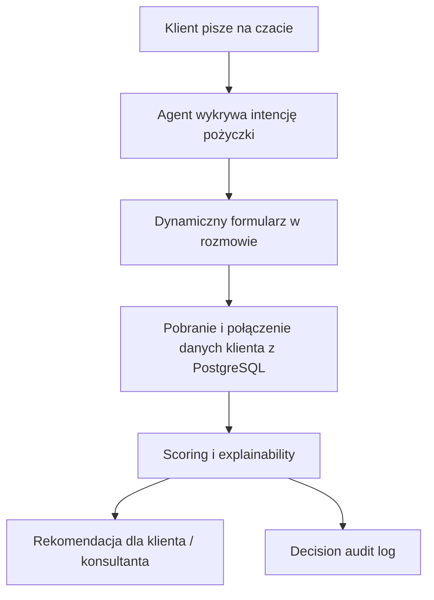

# Loan Decision Copilot — App Brief

## Elevator Pitch
Loan Decision Copilot to szkoleniowe MVP bankowego asystenta konwersacyjnego. Klient zaczyna rozmowę na czacie, agent rozpoznaje intencję związaną z pożyczką, wyświetla dynamiczny formularz, pobiera dane klienta z PostgreSQL, oblicza wynik scoringowy i zwraca rekomendację z uzasadnieniem oraz pełnym śladem audytowym.

## Dlaczego ten pomysł pasuje do tej grupy
- Jest osadzony w realiach bankowych.
- Daje dużo miejsca na SQL, PostgreSQL, joiny, agregacje i historię danych.
- Zachowuje ciekawy, agentowy flow z dynamicznym formularzem w rozmowie.
- Daje pole zarówno dla Java/backend, jak i dla DBA/SQL oraz architektów.
- Pozwala pokazać explainability i audit trail zamiast „LLM magic”.

## Główne persony

### 1. Klient banku
- Chce szybko sprawdzić możliwość uzyskania pożyczki.
- Nie chce przechodzić od razu przez duży, sztywny proces.
- Oczekuje prostego języka i szybkiej odpowiedzi.

### 2. Pracownik banku / konsultant
- Chce widzieć wniosek, dane wejściowe i rekomendację.
- Chce rozumieć, z czego wynika rekomendacja.
- Potrzebuje śladu decyzji i działań systemu.

### 3. Audytor / analityk wewnętrzny
- Chce odtworzyć przebieg decyzji.
- Chce wiedzieć, jakie dane i reguły były użyte.
- Chce mieć czytelny audit trail.

## Główny user flow
1. Klient rozpoczyna rozmowę w czacie.
2. Agent rozpoznaje intencję: pytanie o pożyczkę / wniosek.
3. Agent wyświetla dynamiczny formularz z podstawowymi polami.
4. System pobiera i łączy dane klienta z bazy.
5. System oblicza scoring i przygotowuje uzasadnienie.
6. Agent zwraca rekomendację: wstępnie pozytywna / wymaga dodatkowej weryfikacji / odrzucona.
7. Wszystkie kroki trafiają do audit trail.

## Zakres MVP
- Chat UI z podstawową rozmową.
- Wykrywanie intencji loan-related.
- Dynamiczny formularz w odpowiedzi na kontekst rozmowy.
- Relacyjny model danych w PostgreSQL.
- Prosty, jawny scoring oparty na danych demo i regułach.
- Explainability: krótkie uzasadnienie wyniku.
- Audit trail decyzji i działań agenta.

## Out of Scope
- Produkcyjny scoring bankowy.
- Integracje z realnymi systemami banku.
- KYC, AML, podpisy elektroniczne, workflow prawny.
- Zaawansowane modele ML.
- Realne dane osobowe i realne ryzyko kredytowe.
- Rozbudowany panel operacyjny dla wielu ról.

## Proponowany model danych
- `customers`
- `loan_applications`
- `financial_profiles`
- `income_records`
- `liabilities`
- `repayment_history`
- `scoring_rules`
- `decision_audit_log`
- `chat_sessions`
- `agent_actions`

## Jedno zdanie opisujące projekt
„Budujemy chatowego asystenta bankowego, który potrafi zebrać dane do wniosku o pożyczkę, połączyć je z historią finansową klienta w PostgreSQL i zwrócić wyjaśnialną rekomendację z pełnym śladem audytowym.”
