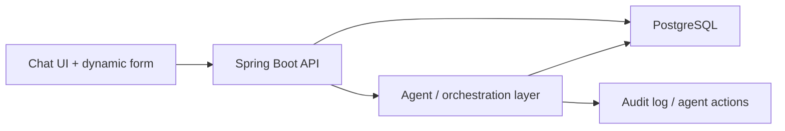
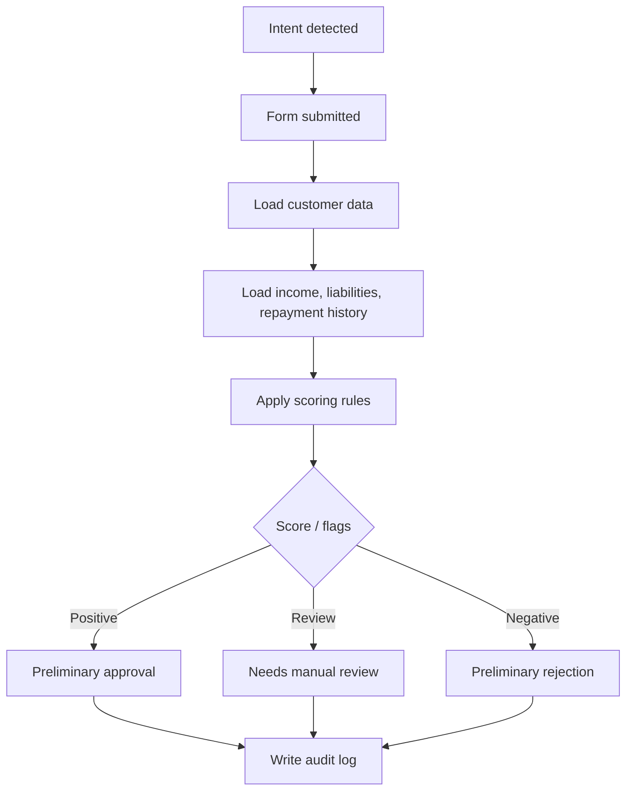
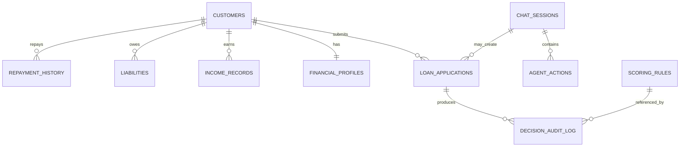

# PRD — Loan Decision Copilot

## 1. Problem Statement
Użytkownik końcowy lub konsultant bankowy potrzebuje szybkiej, zrozumiałej i audytowalnej wstępnej oceny wniosku o pożyczkę. Klasyczny formularz jest sztywny i nie pokazuje dobrze potencjału agentowego UI. Jednocześnie grupa szkoleniowa potrzebuje projektu, który realistycznie wykorzystuje PostgreSQL, SQL i wielotabelowy model danych.

## 2. Cel produktu
Stworzyć szkoleniowe MVP pokazujące, jak agent może:
- prowadzić rozmowę z klientem,
- dynamicznie przełączać się z czatu na formularz,
- pobierać i łączyć dane finansowe z PostgreSQL,
- obliczać prosty, jawny scoring,
- zwracać rekomendację z uzasadnieniem,
- zostawiać ślad audytowy.

## 3. Persony

### Klient banku
- Chce sprawdzić, czy ma szansę na pożyczkę.
- Oczekuje prostego procesu i szybkiej odpowiedzi.

### Konsultant
- Chce widzieć dane wejściowe, wynik i uzasadnienie.
- Potrzebuje zaufania do procesu i jasnych podstaw decyzji.

### Audytor / analityk
- Chce odtworzyć, jakie dane, reguły i działania wpłynęły na wynik.

## 4. User Stories
1. Jako klient chcę rozpocząć temat pożyczki naturalnym językiem na czacie.
2. Jako klient chcę, aby formularz pojawił się wtedy, kiedy rozmowa tego wymaga, a nie od razu.
3. Jako klient chcę podać podstawowe dane do wniosku w prosty sposób.
4. Jako system chcę pobrać dane klienta i jego historię finansową z PostgreSQL.
5. Jako system chcę obliczyć prosty wynik scoringowy na podstawie jawnych reguł.
6. Jako klient chcę dostać krótkie, zrozumiałe uzasadnienie rekomendacji.
7. Jako konsultant chcę zobaczyć, jakie czynniki wpłynęły na wynik.
8. Jako audytor chcę odtworzyć ścieżkę decyzji i działań agenta.
9. Jako zespół szkoleniowy chcemy mieć model danych, który daje sensowne ćwiczenia SQL.
10. Jako prowadzący chcę móc wykorzystać projekt jako bazę do kolejnych dni kursu.

## 5. Scope MVP
- Chat UI z prostym flow rozmowy.
- Dynamiczny formularz dla danych pożyczkowych.
- PostgreSQL jako główne źródło danych demo.
- Seed data dla klientów, dochodów, zobowiązań i historii spłat.
- Prosty scoring oparty na regułach.
- Explainability i audit trail.
- Dokumentacja: PRD, ADR, diagramy Mermaid.

## 6. Out of Scope
- Produkcyjne decyzje kredytowe.
- Integracje z realnymi systemami bankowymi.
- Zaawansowane modele ryzyka.
- Panel administracyjny klasy enterprise.
- Wieloetapowy workflow zgód i akceptacji.
- Autoryzacja produkcyjna i pełna zgodność regulacyjna.

## 7. Wymagania funkcjonalne
- System rozpoznaje intencję związaną z pożyczką.
- System wyświetla dynamiczny formularz w odpowiedzi na kontekst rozmowy.
- System zapisuje sesję rozmowy i działania agenta.
- System pobiera i łączy dane klienta z wielu tabel.
- System oblicza jawny scoring.
- System zwraca rekomendację i krótkie wyjaśnienie.
- System zapisuje decision audit log.

## 8. Wymagania niefunkcjonalne
- Rozwiązanie ma być możliwe do zbudowania i pokazania w ramach kursu.
- Model danych ma być zrozumiały dla mixed-seniority grupy.
- Dane demo nie mogą zawierać realnych danych wrażliwych.
- Każda kluczowa decyzja ma być możliwa do odtworzenia.
- Architektura ma być wystarczająco prosta do iteracyjnego rozwoju przez agenta.

## 9. Acceptance Criteria
1. Użytkownik może rozpocząć temat pożyczki w czacie.
2. System pokazuje formularz tylko w odpowiednim momencie rozmowy.
3. Formularz zbiera podstawowe dane: kwota, okres, identyfikator klienta, cel pożyczki.
4. System potrafi pobrać dane klienta z PostgreSQL.
5. System wykonuje co najmniej jedno zapytanie z joinami do zbudowania kontekstu decyzji.
6. System oblicza wynik na podstawie prostych, jawnych reguł.
7. System zwraca wynik z krótkim uzasadnieniem.
8. System zapisuje log decyzji i działań.
9. Zespół potrafi wskazać, z jakich tabel i pól wynikała decyzja.
10. Artefakty dokumentacyjne wystarczają do wejścia w implementację w dniu 3.

## 10. Założenia dla danych demo
- Dane klientów są fikcyjne.
- Dochody i zobowiązania są uproszczone, ale realistycznie nazwane.
- Historia spłat zawiera przynajmniej kilka przypadków pozytywnych i negatywnych.
- Reguły scoringowe są jawne i możliwe do zmiany.

## 11. Ryzyka
- Zbyt szeroki scope i utrata tempa.
- Za dużo frameworków naraz.
- Nadmierne zaufanie do AI bez weryfikacji modelu danych i kryteriów.
- Zmieszanie logiki scoringowej z warstwą czysto konwersacyjną.

## 12. High-Level Architecture

## 13. Decision Flow

## 14. Data Model Overview

